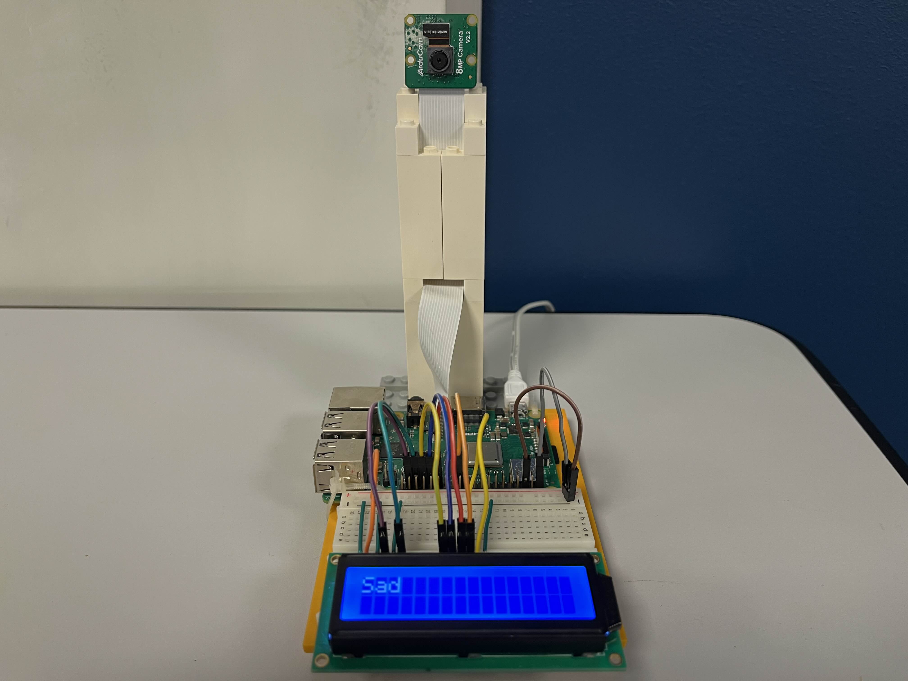

# FERR3B : Facial Emotion Recognition on Raspberry 3B+

<p align="center">
  
</p>

### Config

- Raspberry Pi 3B+ with Raspberry Pi OS (Legacy, 64-bit)
- 8MP IMX219 from ArduCam
- an alphanumeric LCD (16x2 characters)

If using the same camera, here are the commands to make camera discoverable :

```
sudo nano /boot/firmware/config.txt 
#Find the line: camera_auto_detect=1, update it to:
camera_auto_detect=0
#Find the line: [all], add the following item under it:
dtoverlay=imx219
#Save and reboot.
```

For other ArduCam camera : https://docs.arducam.com/Raspberry-Pi-Camera/Native-camera/8MP-IMX219/

### Commands to stream video flux from Raspberry to computer through SSH :

On Raspberry :
```
libcamera-vid -t 0 --inline --codec h264 -o - | nc -lkv4 5000
```
On computer :
```
nc <raspberry_ip> 5000 | ffplay -i -
```
### Model

The model is a basic CNN, as defined in `model.py`. We kept it light because of the hardware limitations.

We achieve **~0.61 accuracy** (`train_model.ipynb`) with the CE loss on the test set, SOTA being at **~0.75** (on the FER2013 dataset https://www.kaggle.com/datasets/msambare/fer2013). 

## How to run

```console
foo@bar:~$ python -m venv env
foo@bar:~$ source env/bin/activate
foo@bar:~$ pip install -r requirements.txt
foo@bar:~$ python main.py
```
